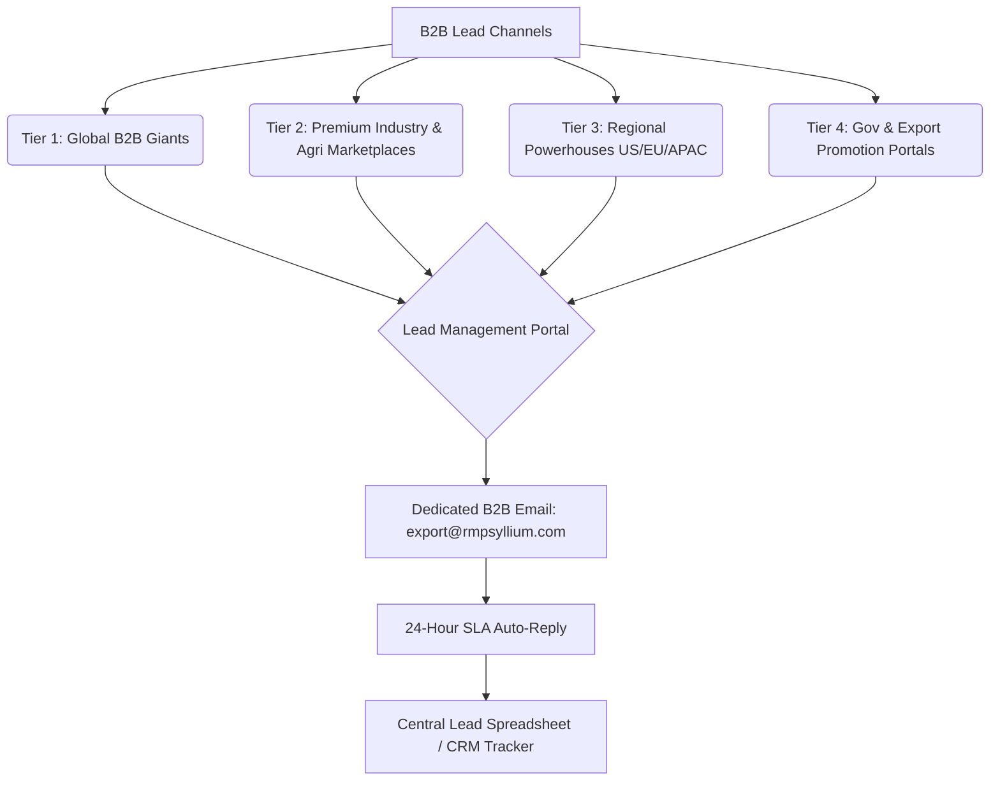

# RM Psyllium: Global B2B Listing Roadmap & Strategy

This document outlines a structured, high-visibility strategy for listing RM Psyllium on global B2B platforms using **100% free tiers** once certifications (IEC, APEDA, FSSAI, etc.) are finalized.

---

## 🗺️ Strategy Overview

### 1. Verification Strategy
To maximize visibility with **zero initial cash burn**, you will register on all platforms using their **free basic tiers** as soon as your formal certifications are live.
* **Trust Factor**: Because you are using free tiers, your company profiles must look exceptionally professional. Upload your official government registrations (**FSSAI, APEDA, IEC**) to the platforms' document repositories to obtain "Verified Supplier" or "Registered Trader" status for free wherever available.
* **Organic SEO**: Each profile will link back to your core website [rmpsyllium.com](https://rmpsyllium.com) (or specific product pages), which boosts your domain authority and drives high-intent, commission-free traffic directly to your site.

### 2. Inquiry Management (SLA under 24 Hours)
Portal search algorithms (like Alibaba's or Europages') penalize slow response times.
* **Dedicated Routing**: Route all B2B notification emails to a dedicated inbox (e.g., `export@rmpsyllium.com`).
* **Auto-Reply**: Enable an instant B2B auto-reply containing your professional product catalog/brochure PDF and a link to your interactive spec-builder [rmpsyllium.com/en/products/psyllium-husk/](https://rmpsyllium.com/en/products/psyllium-husk/).
* **Lead Tracker**: Log every lead in a central Google Sheet or CRM to monitor which platforms deliver the highest-quality inquiries (measuring *Conversion Rate = Quality Leads / Total Inquiries*).

---

## 🗂️ The B2B Platform List

Here are the target platforms categorized by tier, including registration links, geographic focus, and listing tips.

### Tier 1: Global B2B Giants (Massive Volume & Sourcing Traffic)

| Platform | Geographic Focus | Key Audience | Registration & Listing Links |
| :--- | :--- | :--- | :--- |
| **Alibaba** | Global (North America, EU, Middle East, APAC) | Bulk importers, wholesalers, distributors, retail buyers. | [Register on Alibaba](https://supplier.alibaba.com/) |
| **IndiaMART** | Global & India Domestic | Foreign buyers sourcing from India, retail brokers, local aggregators. | [Register on IndiaMART](https://seller.indiamart.com/) |
| **TradeIndia** | Global & India Domestic | Wholesalers, import houses, trade agents. | [Register on TradeIndia](https://www.tradeindia.com/Registration/Supplier/) |
| **EC21** | Global (Strong in East Asia: South Korea, Japan, China) | Large industrial importers, food manufacturing procurement teams. | [Register on EC21](https://www.ec21.com/html/join_form.html) |
| **TradeKey** | Global (Strong in Middle East & Latin America) | Commodity buyers, supply chain managers, bulk distributors. | [Register on TradeKey](https://www.tradekey.com/register.html) |

💡 **Tier 1 Optimization Tips:**
* **Keyword Density**: Use specific titles like *"Organic Psyllium Husk 99% Purity (USP/EP Grade) for Food & Pharma"* rather than generic words.
* **Response Score**: Alibaba tracks response speed down to the minute. Ensure your dedicated B2B email is checked daily.

---

### Tier 2: Specialized Food, Pharma & Agriculture Ingredients Marketplaces

Psyllium is highly specialized—sold as a dietary supplement, food stabilizer, or animal feed binder. These niche platforms connect you directly to **R&D departments, formulation chemists, and ingredients procurement managers**.

| Platform | Industry Focus | Key Features for Exporters | Registration & Listing Links |
| :--- | :--- | :--- | :--- |
| **Knowde** | Chemical, Pharma & Food Ingredients | The largest global marketplace for raw materials. Buyers browse by technical spec sheets and order samples directly. | [Register on Knowde](https://www.knowde.com/sell) |
| **Tridge** | Agriculture & Commodities | Incredibly premium. Tridge lists validated suppliers and provides market intelligence for agri-exporters. | [Register on Tridge](https://www.tridge.com/suppliers/signup) |
| **PharmaSources (CPhI)** | Pharmaceutical & Nutraceutical | The primary platform for USP/EP grade psyllium active pharmaceutical ingredients (API). | [Register on PharmaSources](https://www.pharmasources.com/register) |
| **Echemi** | Chemical & Raw Food Ingredients | Excellent for bulk food stabilizer, thickening agent, and binder inquiries globally. | [Register on Echemi](https://www.echemi.com/register.html) |
| **uFoodin** | Food & Beverage Only | A dedicated global marketplace and social network for bulk food ingredients and agriculture. | [Register on uFoodin](https://www.ufoodin.com/register) |

💡 **Tier 2 Optimization Tips:**
* **Technical Focus**: Upload your exact technical specifications (mesh sizes: 40, 60, 100 mesh; swell volume; purity: 95%, 98%, 99%).
* **Certifications**: Clearly state FSSAI, APEDA, and highlight *"GMP, ISO 22000, HACCP Audits in Progress (Q3 2026)"* to build immediate regulatory confidence.

---

### Tier 3: Regional Powerhouses (US, Europe, Institutional Procurement)

These platforms are used by corporate purchasing departments that bypass general search engines to find long-term contract manufacturers and vetted industrial suppliers.

| Platform | Geographic Focus | Target Audience | Registration & Listing Links |
| :--- | :--- | :--- | :--- |
| **ThomasNet** | North America (US & Canada) | Industrial manufacturers, private-label brand owners, US contract packagers. | [Register on ThomasNet](https://www.thomasnet.com/about/register/) |
| **Europages** | European Union (Multi-lingual) | European food manufacturers, pharma compounders, European agricultural distributors. | [Register on Europages](https://www.europages.co.uk/ep-ep-site/register) |
| **Kompass** | Global (Very strong in Western & Eastern Europe) | Highly structured company directory used for B2B prospecting by institutional buyers. | [Register on Kompass](https://register.kompass.com/) |
| **WLW (Wer liefert was)** | Germany, Austria, Switzerland (DACH Region) | The leading B2B directory in Germany—a prime region for high-purity organic psyllium. | [Register on WLW](https://www.wlw.de/en/registration) |
| **ECPlaza** | APAC (Strong in East Asia & Southeast Asia) | Importers, sourcing agents, and trading conglomerates. | [Register on ECPlaza](https://www.ecplaza.net/members/join) |

💡 **Tier 3 Optimization Tips:**
* **Multilingual Pages**: For Europages and WLW, leverage your site's translated microsites (`/de/` for Germany, `/fr/` for France, `/es/` for Spain) to attract local-language search terms in Europe.

---

### Tier 4: Government & Export Promotion Portals (High Authority Backlinks)

These platforms provide the absolute highest trust factor because registration requires physical government vetting in India.

| Platform | Regulatory Board | Purpose | Registration Link |
| :--- | :--- | :--- | :--- |
| **APEDA AgriExchange** | Agricultural and Processed Food Products Export Development Authority (India) | Direct platform for Indian agri-exporters to receive global trade leads generated through Indian embassies worldwide. | [Register on AgriExchange](https://agriexchange.apeda.gov.in/Supplier_Registration.aspx) |
| **FIEO (Federation of Indian Export Organisations)** | Ministry of Commerce & Industry (India) | Directory of vetted Indian exporters, highly trusted by foreign embassies and consulates. | [Register on FIEO](https://www.fieo.org/) |

---

## 📝 Profile Setup Assets & Content Templates

Save time during registration by copying and pasting these pre-optimized templates into your profile fields.

### 🏢 Company Overview (For "About Us" / Profile Description)

> **Company Name**: RM Psyllium
> **Headquarters**: India (Gujarat/Rajasthan border - the heart of global Psyllium cultivation)
> **Primary Business Type**: Manufacturer, Exporter & Custom Contract Processor
> **Tagline**: Premium-Grade Psyllium Husks & Powders for Global Food, Pharma, and Feed Industries.
>
> **Corporate Description (500 Words - Optimize for Search & AEO)**:
> RM Psyllium is a specialized manufacturer and global exporter of premium-grade Psyllium (Plantago ovata) products, situated at the epicenter of India's psyllium growing belt. We supply high-purity Psyllium Husks, Psyllium Husk Powders, Psyllium Seeds, Psyllium Khakha Powder, and Organic Psyllium tailored for international buyers in the Pharmaceutical, Nutraceutical, Food & Beverage, and Animal Feed sectors.
>
> Our production facilities utilize advanced sorting, milling, and sterilization technologies to deliver custom-specifications (from 40 mesh to 100 mesh, with swell volumes exceeding 40 ml/g and purities up to 99%). We operate with complete batch-level traceability and rigorous quality control, providing lot-specific NABL-accredited Certificates of Analysis (COA), phytosanitary certificates, and chamber-attested Certificates of Origin with every shipment.
>
> RM Psyllium is registered with FSSAI, APEDA, and IEC, with advanced ISO 22000, HACCP, and GMP audits currently in progress (scheduled for completion Q3 2026). Whether you require organic-certified psyllium, no-MOQ trial batches, or reliable bulk container-load shipments FOB Mundra or CIF worldwide, RM Psyllium is your transparent supply chain partner.

---

### 📦 Recommended Product Listing Specifications

Use these exact specifications when adding products to B2B catalogs.

#### 1. Psyllium Husk (99% / 98% / 95% Purity)
* **HS Code**: `1211.90.32` (India export custom classification)
* **Product Title**: Premium Psyllium Husk (95% to 99% Purity) - Bulk Food & Pharma Grade
* **Applications**: Dietary supplements, fiber fortification, gluten-free baking binder.
* **Packaging**: 25 kg / 50 kg PP bags, paper bags, or custom bulk jumbo bags.
* **Product URL to Link**: [https://rmpsyllium.com/en/products/psyllium-husk/](https://rmpsyllium.com/en/products/psyllium-husk/)

#### 2. Psyllium Husk Powder (40 to 100 Mesh)
* **HS Code**: `1211.90.32` (or vegetable mucilages `1302.32`)
* **Product Title**: Fine Psyllium Husk Powder (40 Mesh, 60 Mesh, 100 Mesh) - Custom Milling
* **Applications**: Pharmaceutical compounding, nutraceutical capsules, powder mixes, and beverages.
* **Key Spec**: Swell volume > 40 ml/g, low microbial count, NABL lab certified.
* **Product URL to Link**: [https://rmpsyllium.com/en/products/psyllium-husk-powder/](https://rmpsyllium.com/en/products/psyllium-husk-powder/)

#### 3. Psyllium Khakha Powder & Cattle Feed
* **HS Code**: `2308.00.00` or `1211.90.32` (Agri byproduct)
* **Product Title**: Psyllium Khakha Powder - Bulk Animal Feed & Industrial Grade Binder
* **Applications**: High-fiber veterinary feed, cattle feed digestion supplements, industrial binding agent.
* **Product URL to Link**: [https://rmpsyllium.com/en/products/psyllium-cattle-feed/](https://rmpsyllium.com/en/products/psyllium-cattle-feed/)

---

## 🚀 Execution & Tracking Checklist

Use this checklist to track your B2B listing project step-by-step:

- [ ] **Step 1: Setup Infrastructure**
  - Create the email redirect or inbox: `export@rmpsyllium.com`.
  - Set up a standard B2B inquiry spreadsheet in Google Sheets with columns: *Date | Source Platform | Buyer Name | Country | Quantity Required | Status | Follow-up Date*.
  - Draft your standard email template with the [RM Psyllium PDF Brochure](https://rmpsyllium.com/RM%20Psyllium%20Brochure%202026.pdf) attached.

- [ ] **Step 2: Register on Tier 1 (Giants)**
  - Register free supplier profiles on **Alibaba**, **IndiaMART**, **TradeIndia**, **EC21**, and **TradeKey**.
  - Fill in the profile completely (100% profile score) using the Company Overview template above.
  - Link each profile's website field back to [https://rmpsyllium.com](https://rmpsyllium.com).

- [ ] **Step 3: Register on Tier 2 (Ingredients & Agri)**
  - Create listings on **Knowde**, **Tridge**, **PharmaSources**, **Echemi**, and **uFoodin**.
  - Upload your technical specifications and highlight FSSAI/APEDA certification.

- [ ] **Step 4: Register on Tier 3 (Regional directories)**
  - Register on **Europages**, **ThomasNet** (highly critical for US manufacturing inquiries), **Kompass**, and **WLW**.
  - Map German and French inquiry targets to your localized website routes where appropriate.

- [ ] **Step 5: Register on Tier 4 (Government Boards)**
  - Register with **APEDA AgriExchange** and **FIEO** using your active IEC (Import Export Code).

- [ ] **Step 6: Weekly Performance Review**
  - Check the inquiry tracker spreadsheet every Friday.
  - Identify which directory is providing the highest quality leads (e.g. actual purchase managers vs. low-volume retail inquiries).
  - If a particular directory (like Alibaba or Knowde) generates high-intent leads, consider upgrading to a paid tier on *only* that platform to double your organic traffic.
